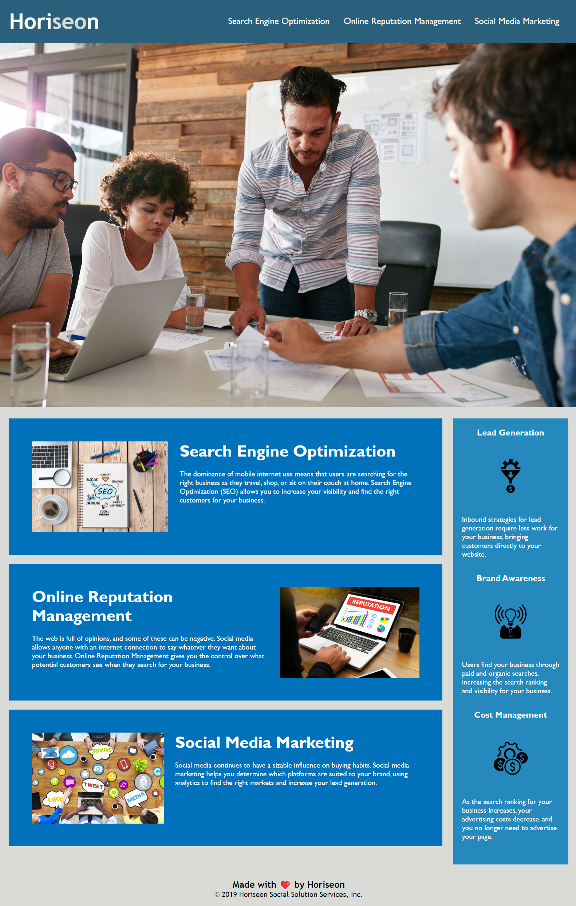

<h1>DESCRIPTION</h1>

<h2>This is the first challenge for week 1. Attached are the link to my webpage along with my repository.</h2>

<h3>This is what was done to fix the webpage:</h3>

<li>Link was fixed by adding ID to first section search-engine-optimization</li>
<li>Changed Benefit CSS from "benefit-brand, benefit-lead Benefit-cost to one "benefit" class</li>
<li>Changed benefit CSS class to one benefit class h3 instead of 3 different benefit classes</li>
<li>Changed benefit CSS class for benefit img into one class</li>
<li>changed .online-reputation-management  .search-engine-optimization .social-media marketing to one service tag</li>
<li>service titles changed to service h2</li>
<li>Added alt tags to all images</li>
VS Code was used to make the changes to the file

<h2>Links:</h2>
Link to page:
<a href="https://khernandez0810.github.io/kevin-bootcamp-challenge1/"> link to webpage</a>

Link to Repository:
<a href="https://github.com/khernandez0810/kevin-bootcamp-challenge1"> Link to repository</a>

Screenshot Example of Webpage:

